# Звіт: Налаштування SonarCloud SAST для juice-shop

## Мета
Інтеграція SonarCloud у GitHub Actions для виконання статичного 
тестування безпеки (SAST) на Node.js додатку juice-shop.

---

## Крок 1: Fork репозиторію
Створено fork репозиторію `dimdimuzun/juice-shop-github-actions` 
на власний акаунт GitHub.

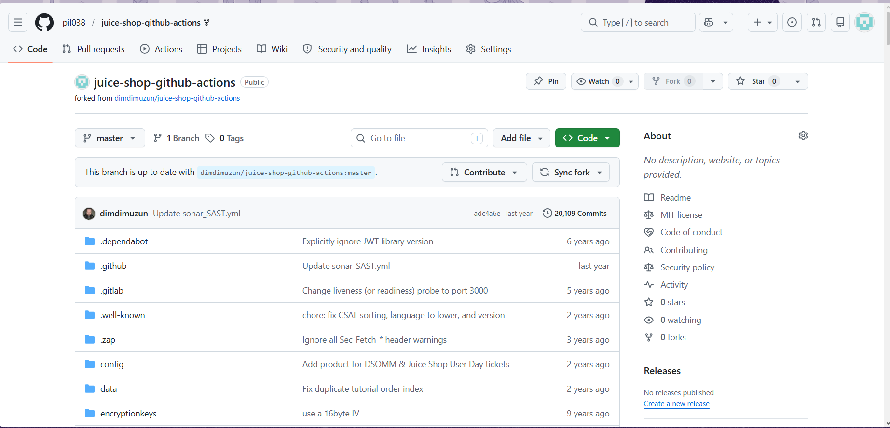

---

## Крок 2: Реєстрація в SonarCloud та створення організації
Виконано вхід у SonarCloud через GitHub. Створено організацію 
з ключем `pil038`.

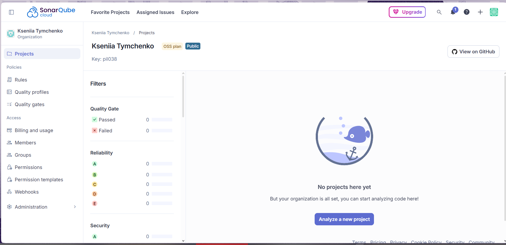

---

## Крок 3: Підключення репозиторію до SonarCloud
Обрано репозиторій `juice-shop-github-actions` для аналізу 
та натиснуто Set Up.

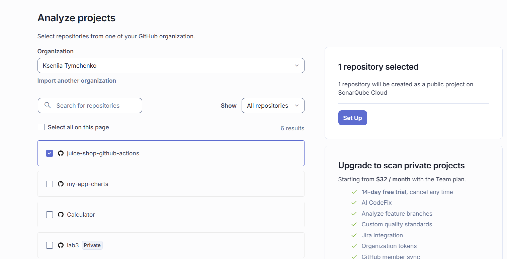

---

## Крок 4: Перший автоматичний аналіз SonarCloud
SonarCloud виконав перший аналіз проєкту.

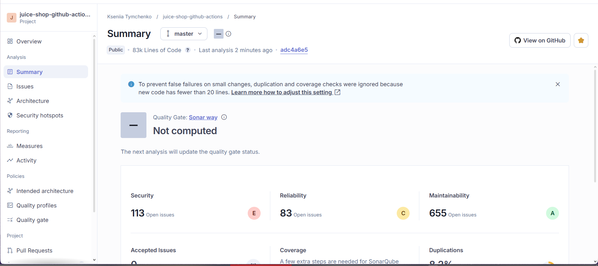

---

## Крок 5: Генерація SONAR_TOKEN (1)
Перехід до налаштувань безпеки акаунту SonarCloud.

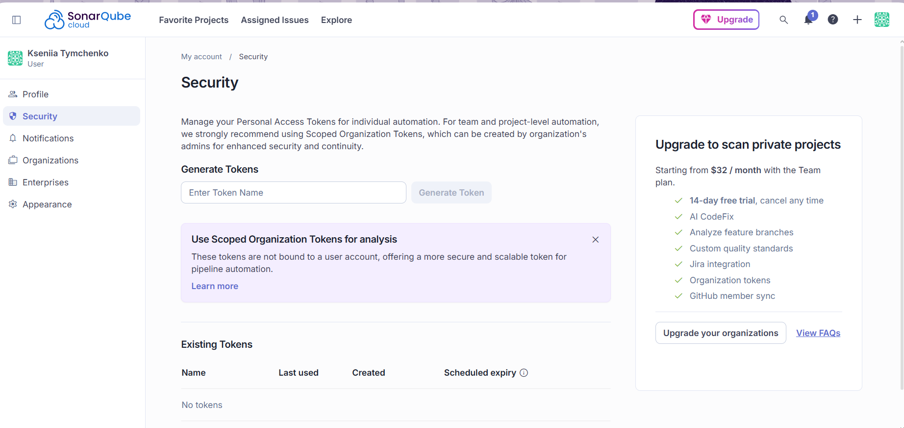

---

## Крок 6: Генерація SONAR_TOKEN (2)
Введено назву токену `GitHubActionsSonarCloud`.

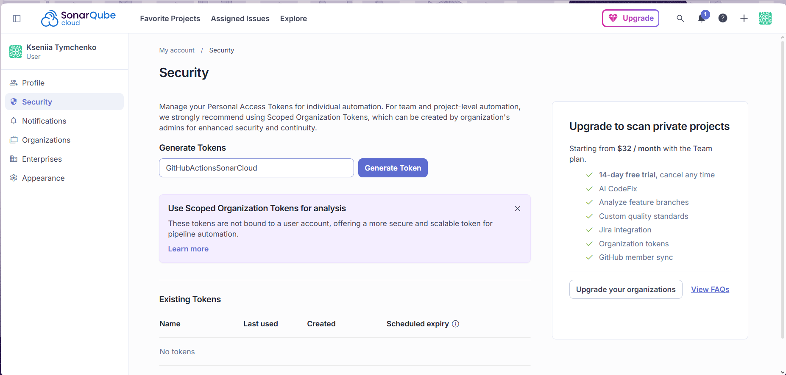

---

## Крок 7: Генерація SONAR_TOKEN (3)
Токен успішно згенеровано та скопійовано.

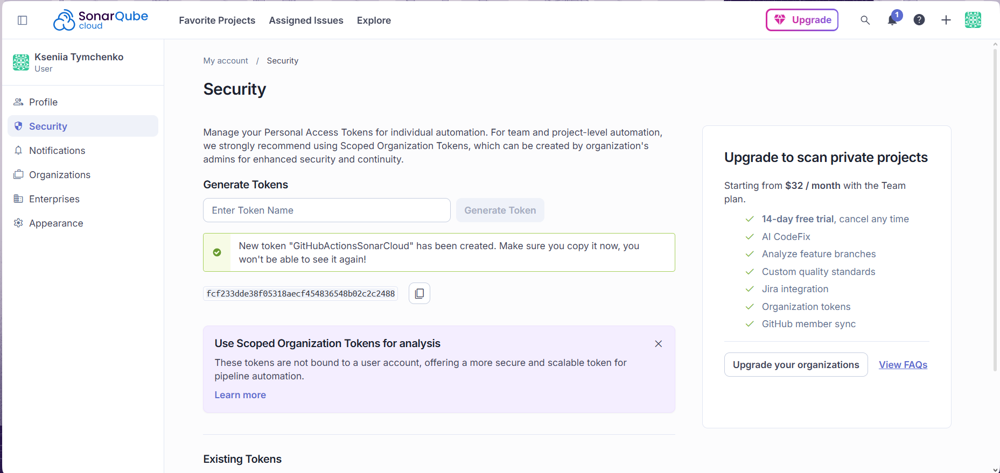

---

## Крок 8: Додавання SONAR_TOKEN у GitHub Secrets (1)
Перехід до Settings → Secrets and variables → Actions.

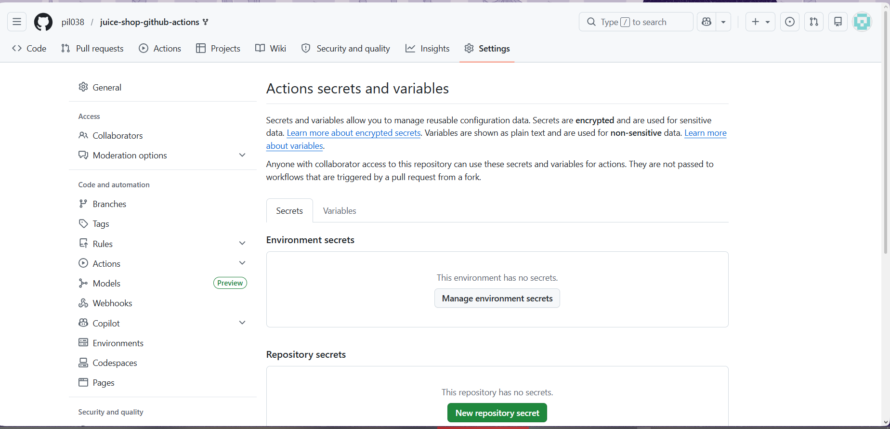

---

## Крок 9: Додавання SONAR_TOKEN у GitHub Secrets (2)
Заповнено форму: Name=`SONAR_TOKEN`, Secret=значення токену.

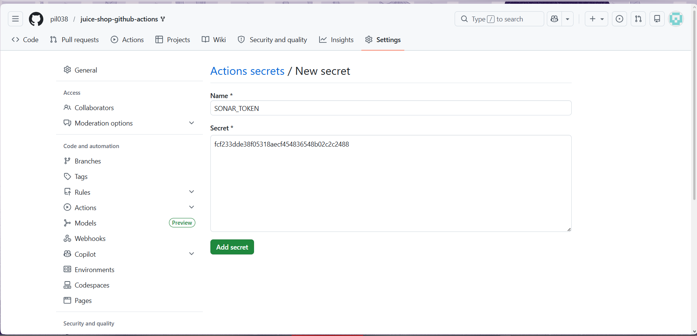

---

## Крок 10: SONAR_TOKEN збережено
Секрет `SONAR_TOKEN` успішно додано до репозиторію.

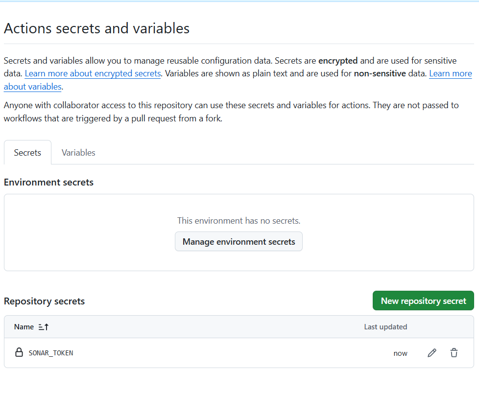

---

## Крок 11: Налаштування sonar-project.properties (1)
Редагування файлу з даними оригінального автора.

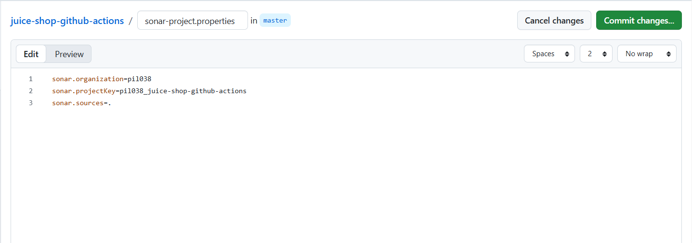

---

## Крок 12: Налаштування sonar-project.properties (2)
Файл оновлено з власними даними організації та проєкту.

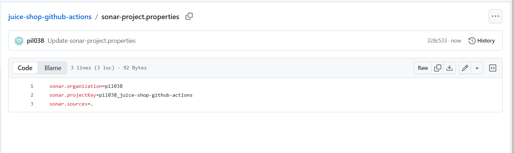

---

## Крок 13: Увімкнення GitHub Actions
Увімкнено GitHub Actions у форкнутому репозиторії.

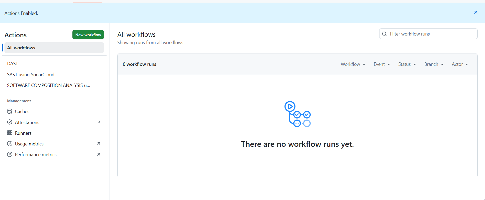

---

## Крок 14: Запуск Workflow
Після коміту автоматично запустились 3 workflow включно з 
`SAST using SonarCloud`.

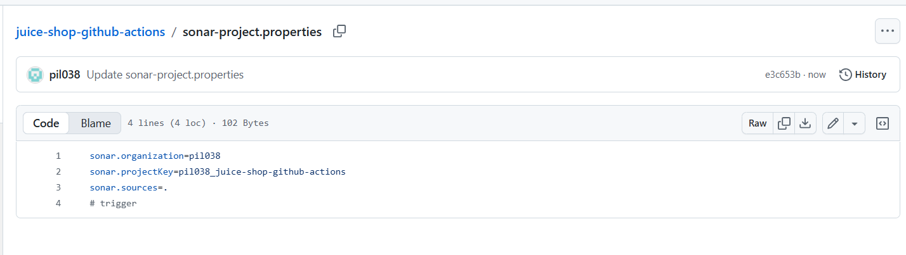
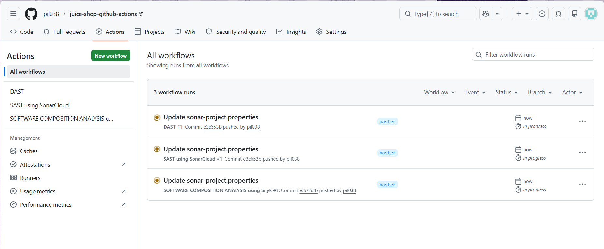
---

## Крок 15: Помилка першого запуску
Workflow завершився з помилкою — конфлікт між CI аналізом 
та Automatic Analysis у SonarCloud.

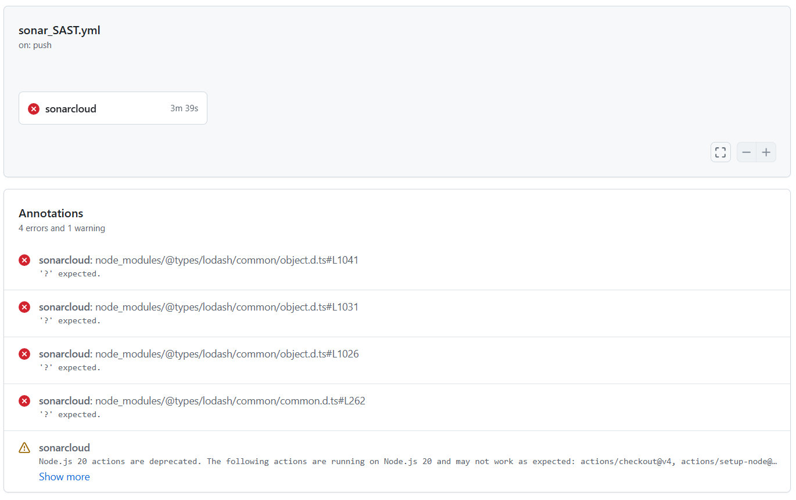
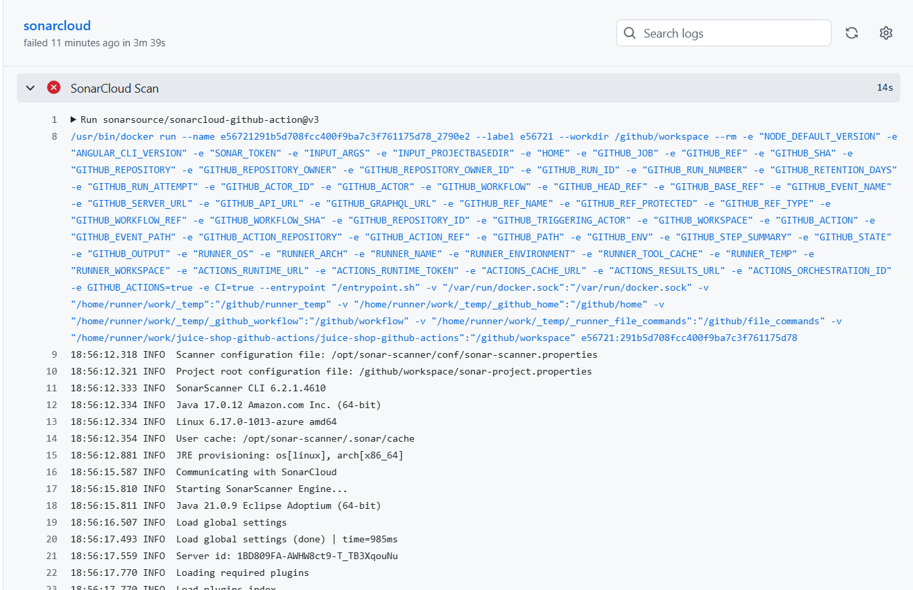
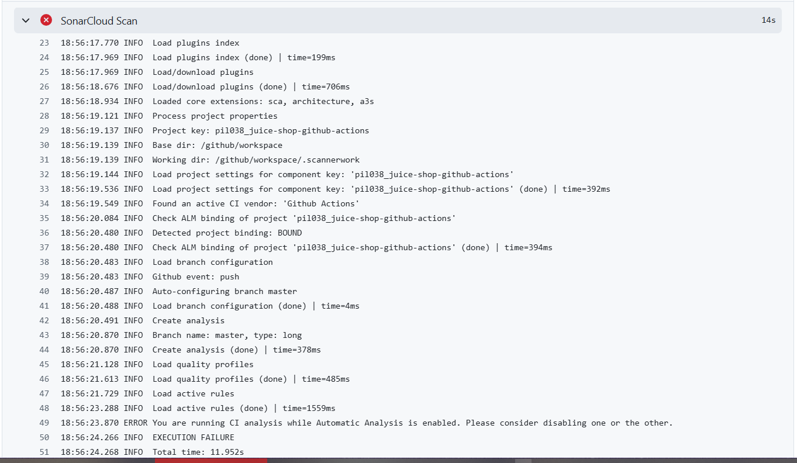

---

## Крок 16: Вимкнення Automatic Analysis
У SonarCloud → Administration → Analysis method вимкнено 
Automatic Analysis.

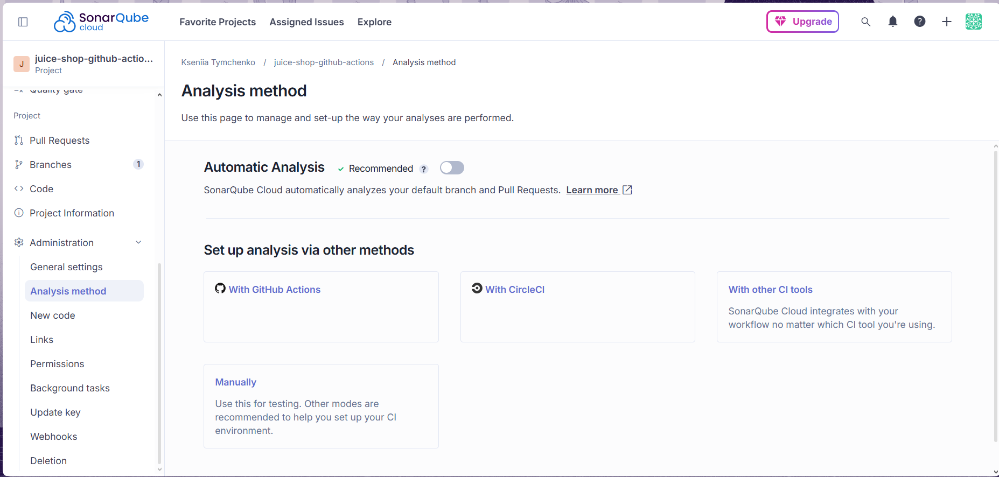

---

## Крок 17: Успішне виконання Workflow
Після повторного запуску workflow завершився зі статусом 
**Success** за 6 хвилин.

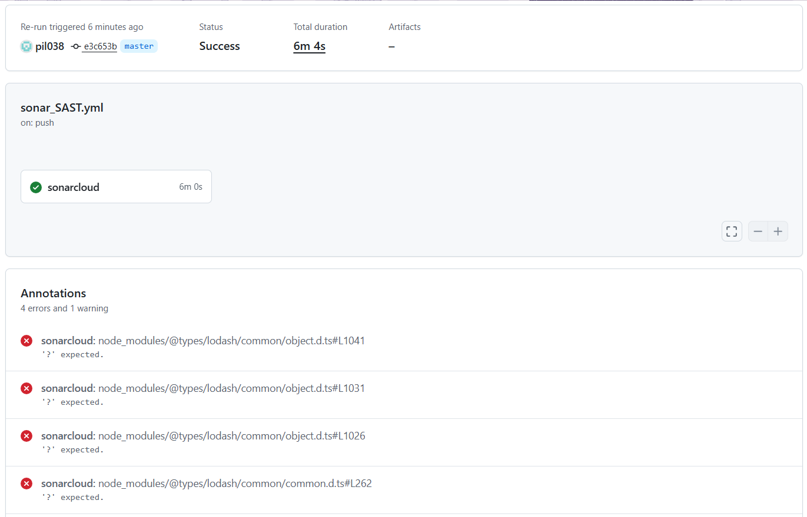

---

## Крок 18: Результати сканування в SonarCloud
SonarCloud виявив issues у коді — це очікувано, оскільки 
juice-shop є навмисно вразливим додатком для навчання.

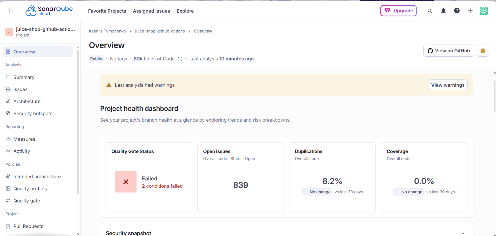

---

## Висновок
Успішно налаштовано GitHub Actions Workflow для інтеграції 
SonarCloud SAST:
- Workflow автоматично запускається при кожному push у гілку `master`
- SonarCloud сканує код та надає детальний звіт про вразливості
- Використано секретні змінні `SONAR_TOKEN` для безпечної 
автентифікації
